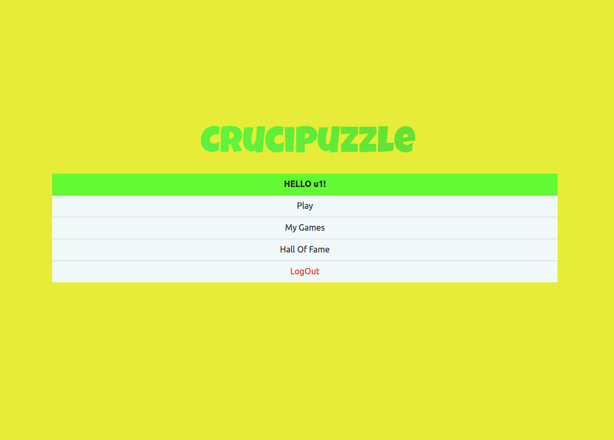

# Exam #5: "CruciPuzzle"
## Student: s281702 Barca Marco

## React Client Application Routes

- Route `/`: contains the initial page of the app, allow to logIn or enter as a guest. Once logged or entered as guest it shows the menu.
- Route `/main/:GameDifficult`: contains the game itself. The GameDifficult param allow to set the difficult.
- Route `/hallOfFame` : contains the Hall Of Fame of the game.
- Route `/myGames` : contains the list of all the games played by the user (it is accessible only from logged users).

## API Server

- POST `/api/login`
  - request parameters and request body content
  - response body content
- GET `/api/getPuzzle`
  - request parameters
  - response body content
- GET `/api/getWordCheck`
  - request parameters
  - response body content
- GET `/api/getHallOfFame`
  - request parameters
  - response body content
- GET `/api/getMyGames`
  - request parameters
  - response body content
- POST `/api/createGame`
  - request parameters and request body content
  - response body content

## Database Tables

- Table `user` - contains the registered users (id, username, password)
- Table `games` - contains all the played games (id, username, score)

## Main React Components

- `LoginForm` (in `LoginComponent.js`): form that manages the LogIn.
- `GameGrid` (in `GameGrid.js`): grid of the puzzle and all the game logic.
- `Menu` (in `MyMenu.js`):  menu that appears at '/'. It allow to play, see the played games and the HoF, execute the LogOut.
- `SettingsModal` (in `MyModal.js`): modal that allow to set the difficult of the game. It appears at '/main'.
- `Timer` (in `Timer.js`): countdown of the game. It appears at '/main'.

## Screenshot
- Root page

## Users Credentials

- u1, p1
- u2, p2
- u3, p3
- u4, p4
- u5, p5
