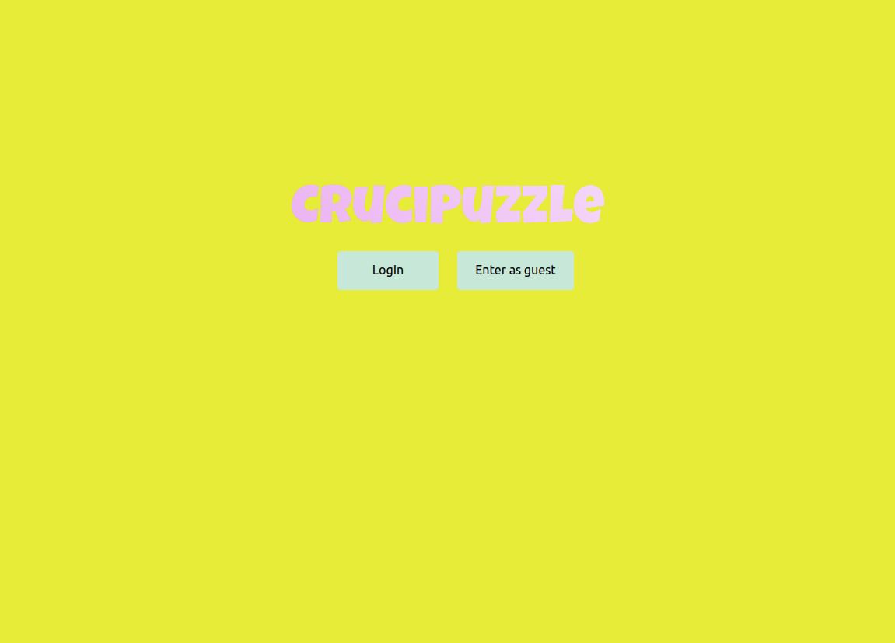
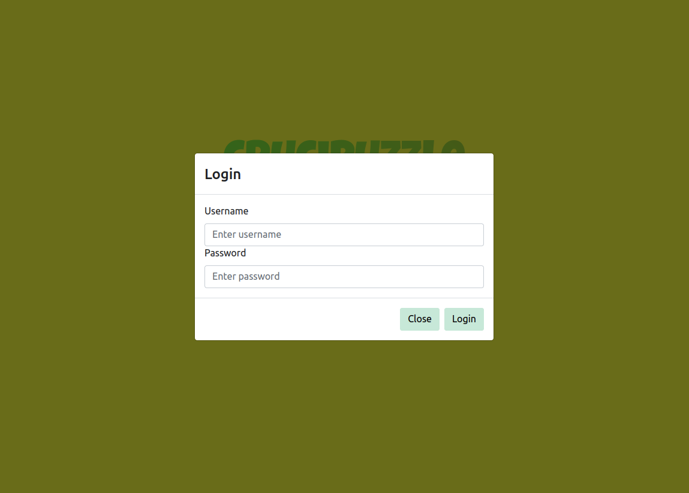
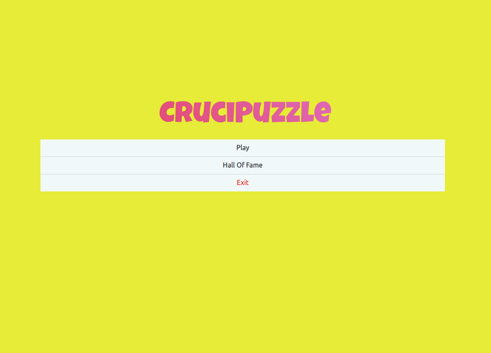
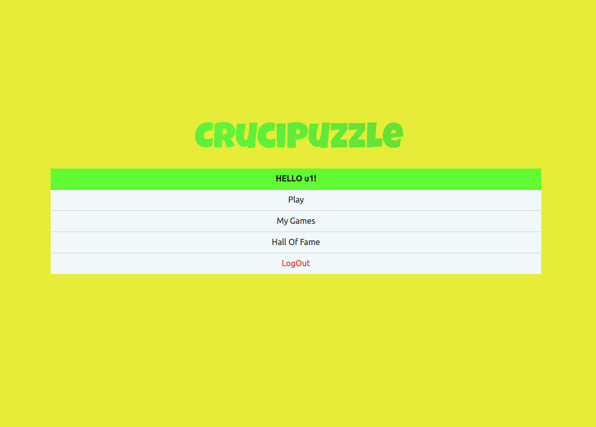
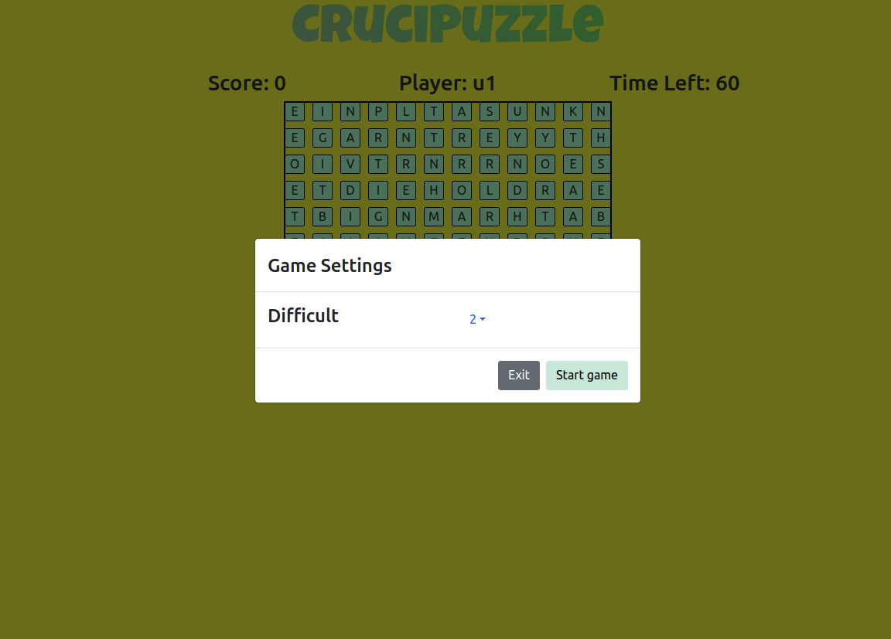
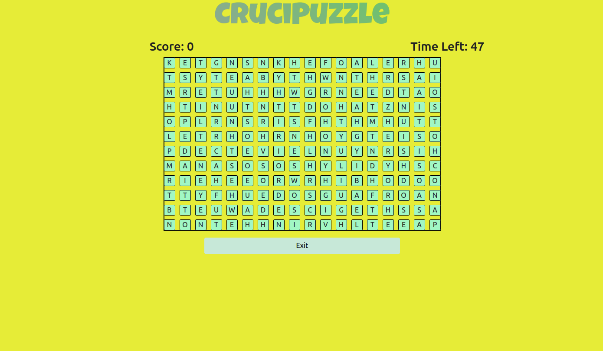
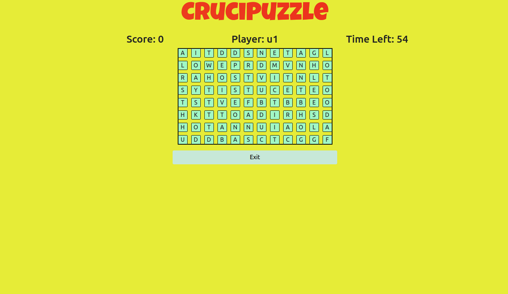
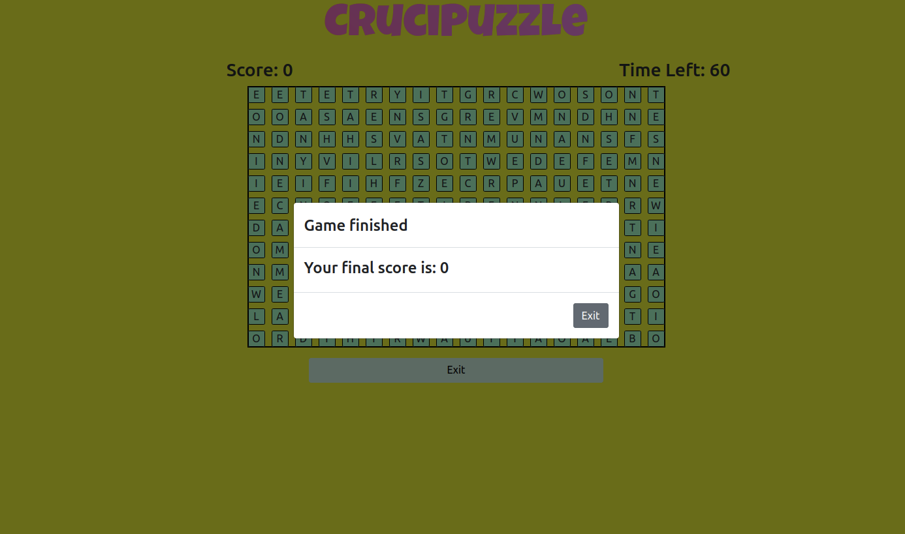
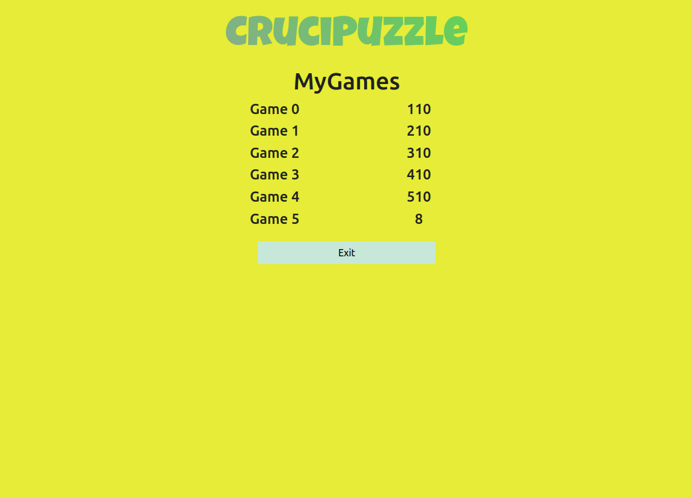
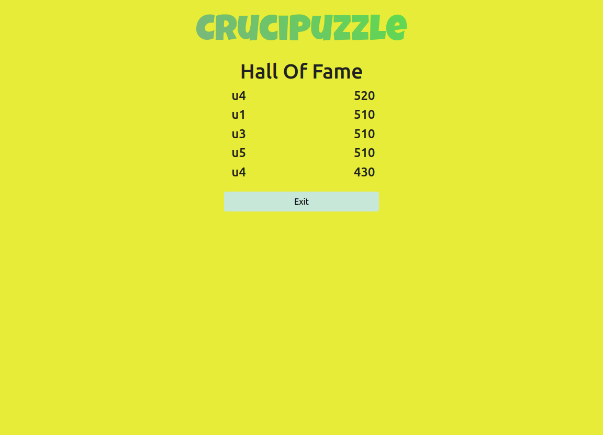

# "CruciPuzzle"

## React Client Application Routes

- Route `/`: contains the initial page of the app, allow to logIn or enter as a guest. Once logged or entered as guest it shows the menu.
- Route `/main/:GameDifficult`: contains the game itself. The GameDifficult param allow to set the difficult.
- Route `/hallOfFame` : contains the Hall Of Fame of the game.
- Route `/myGames` : contains the list of all the games played by the user (it is accessible only from logged users).

## API Server

- POST `/api/session`
  - request parameters: none
  - request body content: an object that rapresent the user (username and password)
  ```json
    {"username":"u1","password":"p1"}
  ```
  - response body content: an object containing id and username of the current logged user data
  ```json
    {"id":1,"username":"u1"}
  ```
  ---
    
- DELETE `/api/sessions/current` 
  - request parameters : none
  - request body : none
  - response body : none
  
    *(Log out API)*

  ---

- GET `/api/puzzle?gameDifficult=`
  - request parameters: 'gameDifficult'
  - response body content: a matrix that rapresent the game grid
  ```json
    [["P","E","N","V","D","E"],
     ["I","H","E","A","W","U"],
     ["D","I","B","N","N","B"],
     ["E","T","T","E","N","I"]]
   ```
  ---
     
- GET `/api/check?word=`
  - request parameters: 'word' the word that the player find in the grid.
  - response body content: true/false (if the word exists or not).

  ---
  
- GET `/api/getHallOfFame`
  - request parameters: none.
  - response body content: an array of games (username and score)
  ```json
  [{"username":"u4","score":520},
   {"username":"u1","score":510},
   {"username":"u3","score":510},
   {"username":"u5","score":510},
   {"username":"u4","score":430}]
  ```
  
  ---
  
- GET `/api/MyGames?username:u1`
  - request parameters: 'username'.
  - response body content: an array of games (username and score)
  ```json
  [{"username":"u1","score":150},
   {"username":"u1","score":240},
   {"username":"u1","score":330},
   {"username":"u1","score":420},
   {"username":"u1","score":510}]
  ```
  
  ---
   
- POST `/api/games`
  - request parameters: none.
  - request body content: an object that rapresent a game almost played played by the user
 ```json
    {"username":"u1","score":4}
 ```
  - response body content: none.

## Database Tables

- Table `user` - contains the registered users: id (PK), username(NN), password (NN).
- Table `games` - contains all the played games: id (PK), username (NN), score (NN).

## Main React Components

- `LoginForm` (in `LoginComponent.js`): form that manages the LogIn.
- `GameGrid` (in `GameGrid.js`): grid of the puzzle and all the game logic.
- `Menu` (in `MyMenu.js`):  menu that appears at '/'. It allow to play, see the played games and the HoF, execute the LogOut.
- `SettingsModal` (in `MyModal.js`): modal that allow to set the difficult of the game. It appears at '/main'.
- `Timer` (in `Timer.js`): countdown of the game. It appears at '/main'.

## Screenshot
- Root page


- Login form


- Menu (guest view)


- Menu (logged user view)


- Difficult settings modal


- Game grid (guest view)


- Game grid (logged user view)


- Final score modal


- My Games (logged user view)


- Hall of Fame


## Users Credentials

- u1, p1
- u2, p2
- u3, p3
- u4, p4
- u5, p5
